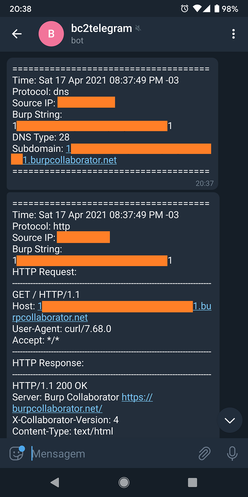

# bc2telegram

Simple script to report Burp Collaborator interactions to Telegram bot chat.

# Requirements

* requests
```
pip3 install requests
```

# How to use

* Create a telegram bot and get the telegram bot token and chat ID (https://gist.github.com/dideler/85de4d64f66c1966788c1b2304b9caf1).
* Get Burp Collaborator polling request URL and link IDs (https://www.onsecurity.io/blog/persistent-access-to-burp-suite-sessions-step-by-step-guide/).
 
```
python3 bc2telegram.py --btoken abcdef... --chad_id 123456789 --bot_token 123456789:AAA...
```

# Telegram messages example



# Contact

* https://twitter.com/ricardo_iramar
* https://twitter.com/phor3nsic_br

# Thanks
* https://github.com/riramar